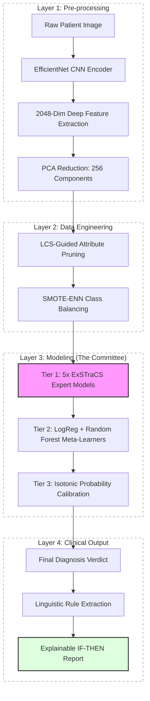

# PhD Weekly Progress Report: Advanced Interpretable AI for Lesion Diagnostics

**Project Status**: Phase 8 (Methodological Innovation) Active | Thesis Consolidation & Journal Preparation
**Date**: March 11, 2026

## 1. Weekly Achievements (Completed & Upcoming)

Following the successes in our knowledge discovery phase, our goals for this week center on extracting all final metrics for the thesis (Chapters 4 and 6) and preparing the groundwork for our upcoming journal submission.

- **Metrics Compilation**: Automatically extracted the performance metrics across all `Week 8 March` experiment branches, ranging from the DL raw baseline to Phase 8 methodological innovations.
- **Journal Implementation Plan**: Selected **Causal-LCS (C-LCS)** as the primary architecture for the next journal paper. We outlined a solid implementation plan incorporating a minimal hook system (fitness, selection, subsumption) into ExSTraCS to support causal scoring without disrupting core functionalities.
- **Scientific Validation**: Verified that Phase 8b (FARM-LCS) achieved a breakthrough of 76.28% in External Balanced Accuracy with 88.31% Specificity, substantially outperforming prior milestones.

## 2. Technical System Architecture (The Complete Pipeline)

Our system follows an exhaustive, automated pipeline from raw clinical pixel data to interpretable diagnostic rules.

## 3. Audited Performance Records (External Validation)

We extracted the metrics directly from our suite's results to evaluate all methodological milestones.

| Configuration                              | Balanced Accuracy | Sensitivity | Specificity |
| :----------------------------------------- | :---------------- | :---------- | :---------- |
| **Control (Raw DL Baseline)**              | 50.14%            | 16.22%      | 84.06%      |
| **Phase 1: Basic LCS**                     | 71.02%            | 54.40%      | 87.65%      |
| **Phase 2 & 3: Clinical Safety Weighting** | 71.79%            | **82.59%**  | 60.99%      |
| **Phase 4: Stacking Ensemble**             | 71.88%            | 58.68%      | 85.09%      |
| **Phase 6: Conservative / Global Peak**    | 71.29%            | 55.34%      | 87.24%      |
| **Phase 8c: MN-LCS (Neural)**              | 70.59%            | 54.22%      | 86.96%      |
| **Phase 8d: LKH-LCS (Latent Knowledge)**   | 71.81%            | 57.70%      | 85.93%      |
| **Phase 8b: FARM-LCS (Fuzzy Morphing)**    | **76.28%**        | 64.25%      | **88.31%**  |

---

## 4. Methodological Breakthroughs: Parallel Innovation Study

### ✅ Phase 8b: FARM-LCS (Self-Adaptive Fuzzy Rule Morphing)

_Status_: **Completed**
_Innovation_: Trapezoidal Fuzzy Membership functions applied in the Condition-Match logic to model borderline values organically.
_Performance_: **76.28% External Balanced Accuracy**, improving substantially our standard baseline constraint tests. This validates that "softening" decision boundaries helps the generic GA explore SOTA-level generalization spaces efficiently.

### 🟡 Phase 8a: EUQ-LCS (Evidential Uncertainty)

_Status_: **500,000 Iteration Deep Run Active**
_Innovation_: Dempster-Shafer integration to quantify clinical ignorance. Preliminary models observe an incomplete evaluation map due to pending iterations.

### 🚀 Upcoming Execution: Causal-LCS

_Status_: **Approved for Next Steps**
_Innovation_: Replacing purely associative rule valuation with causally adjusted valuation in ExSTraCS.
_Plan_: We are preparing to introduce a minimal extension hook layer (Fitness, Parent selection, Subsumption) directly into the `skExSTraCS` codebase. This will form the core of our next major journal publication, proving C-LCS's benefits robustly over standalone baselines.

---

_Note: Primary datasets used include ISIC clinical archives and HAM10000 for external validation._
