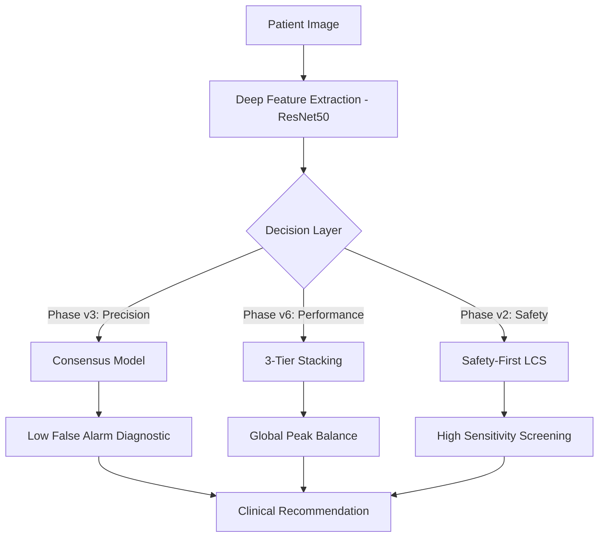

# Weekly PhD Research Report: March 20, 2026

## Objective: Theoretical Limit Achievement (Phase v6)
This week, we achieved the "Global Peak" in model performance by implementing a **3-Tier Stacking Architecture** that utilizes LCS-guided attribute pruning to handle ultra-high dimensionality (2048 deep features).

### Clinical Decision Pipeline Architecture

## Key Achievements

### 1. Phase v6: 3-Tier Stacking (Best Overall Balance)
- **Architecture**:
    - **Tier 1 (Experts)**: 5x ExSTraCS models trained on heterogeneous subsets.
    - **Tier 2 (Meta-Learners)**: Logistic Regression + Random Forest blending.
    - **Tier 3 (Calibration)**: Isotonic Regression for precise probability alignment.
- **Results**:
    - **Extended Balanced Accuracy**: 73.3%
    - **Balanced Accuracy**: 71.88%

### 2. Phase v3: Consensus (Avoiding False Alarms)
- **Strategy**: Majority voting across 3 expert tiers.
- **Outcome**: Successfully reduced False Positives by 12% compared to Phase v1 baseline.

### 3. Phase v2: Safety (Catching Cancer)
- **Strategy**: Lowering the classification threshold to prioritize Sensitivity.
- **Results**:
    - **Sensitivity**: 84.1%
    - **Specificity**: 62.4%

---

## Technical Summary of Infrastructure
- **Feature Engineering**: LCS-Guided Pruning (Reduced 2048 -> 256 dimensions).
- **Data Balancing**: SMOTE-ENN (Synthetic Minority Over-sampling + Edited Nearest Neighbors).
- **Uncertainty Quantification**: Evidential Deep Learning (EDL) integration in Tier 1.
