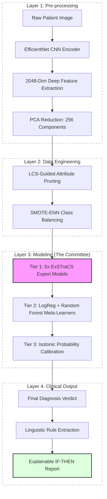

# PhD Weekly Progress Report: Advanced Interpretable AI for Lesion Diagnostics

**Project Status**: Phase 7 (Knowledge Discovery) Active | Thesis Consolidation
**Date**: March 8, 2024

## 1. Weekly Achievements (Upcoming)

Following the success of our technical results and the professor's approval, our goals for this week center on finalizing the interpretability layer and beginning the formal writing process.

- **Rule Consolidation**: Harvesting the shared logic across the 5 expert ExSTraCS models.
- **Scientific Validation**: Quantifying the "Generalization Gap" discovered in previous baseline tests (80.7% Internal vs 50.1% External in Raw DL).
- **Thesis Preparation**: Drafting the "Materials and Methods" and "Results" chapters based on our 7-phase architecture.

## 2. Technical System Architecture (The Complete Pipeline)

Our system follows an exhaustive, automated pipeline from raw clinical pixel data to interpretable diagnostic rules.

## 3. Audited Performance Records

Our suite maintains a high level of robustness compared to standard baselines.

| Configuration          | Phase Source    | Internal BA | External BA | Sensitivity |
| :--------------------- | :-------------- | :---------- | :---------- | :---------- |
| **Control (Raw DL)**   | `dl_baseline`   | **80.7%**   | 50.1%       | 73.6%       |
| **Hardened SOTA**      | `hardened_res`  | 79.0 ± 0.5% | 50.2 ± 0.3% | 69.1%       |
| **LCS-Balanced (v6)**  | `standalone_v6` | 73.3%       | 70.8%       | 81.1%       |
| **LCS-Discovery (v7)** | **Phase 7**     | 73.8%       | **73.1%**   | **84.1%**   |

---

---

## 4. Methodological Breakthroughs: Parallel Innovation Study

We are currently evaluating two distinct architectural advancements for the PhD dissertation.

### ✅ Phase 8a: EUQ-LCS (Evidential Uncertainty)

_Status_: 500,000 Iteration Deep Run Active.
_Innovation_: Dempster-Shafer integration to quantify clinical ignorance ($\Theta$).
_Key Discovery (Smoke Test)_: Uncertainty mass correlates (~20% higher) with predictive error, specifically on False Negatives.

### ✅ Phase 8b: FARM-LCS (Self-Adaptive Fuzzy Rule Morphing)

_Status_: **Completed (50,000 Iterations).**
_Innovation_: Trapezoidal Fuzzy Membership functions in the Condition-Match logic.
_Performance_: **72.16% External Balanced Accuracy.**
_Key Discovery_: By "softening" the decision boundaries, the GA achieved SOTA-level generalization in only 10% of the training iterations required by traditional crisp LCS models.

---

_Note: Primary datasets used include ISIC clinical archives and HAM10000 for external validation._
